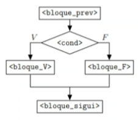

# PROGRAMACIÓN I: clase 4

Fecha de creación: 15 de febrero de 2025 14:06
Clase: PROGRAMACIÓN I
Fecha de la clase: 15 de febrero de 2025

# Arreglos, listas y matrices

## Listas

> Son uno de los tipos de datos que más se utilizan en Python y se caracteriza por ser flexible. Así mismo permite almacenar una colección ordenada de elementos de diferentes tipos (enteros, flotantes, cadenas, etc.). Es decir, las listas son estructuras de datos que almacenan una secuencia ordenada de elementos.
> 

### Características

- Son dinámicas, pueden cambiar de tamaño, es decir, se puede añadir o eliminar elementos.
- Son heterogéneas y ordenadas debido a que pueden almacenar diferentes tipos y mantener ordenada la inserción de los datos.
- Ordenadas
- Mutables
- Permiten duplicados
- Heterogéneas

```python
lista = ['Ciencia', 'Datos', 'Ingenieria', 10, 'Certificacion']
```

## Arreglos (`Array`)

> El módulo `array` estándar proporciona arreglos, que son estructura de datos. Los arreglos son homogéneos, lo que significa que todos los elementos deben ser del mismo tipo, a diferencia de las listas.
> 

### Especificaciones

- Todos los elementos deben ser homogéneos.
- Para operaciones numéricas básicas, son mas eficientes en términos de uso de memoria y rendimiento.

### Beneficios

- Mejor capacidad de almacenamiento y procesamiento de datos numéricos homogéneos.
- Ideal cuando se sabe que todos los elementos serán iguales.

### Restricciones

- Menos adaptable que las listas
- Debe importarse el módulo `array`.

```python
import array

miArreglo = array.array('i', [1, 2, 3, 4, 5])
```

<aside>
📝

La `‘i’` al principio del arreglo hace referencia al soporte de número de bytes en cada elemento.

</aside>

## Matrices

> La biblioteca `NumPy`, es una extensión destinada específicamente a realizar cálculos numéricos eficientes, se utiliza con frecuente para implementar matrices en Python. Es posible que la matrices sean unidimensionales, bidimensionales o multidimensionales.
> 

### Especificaciones

- Todos los elementos deben ser homogéneos (similares a los arreglos).
- Soporta de manera eficiente operaciones matemáticas complejas.
- La capacidad de trabajar con matrices de más de dos dimensiones es posible.

### Beneficios

- Optimizado para álgebra lineal y operaciones numéricas.
- Soporte para operaciones vectorizadas, que son operaciones de procesamiento rápido de grandes cantidades de datos.

### Restricciones

- Es necesario instalar la biblioteca `NumPy`.
- Menos adaptable a la heterogeneidad de los datos.

```python
import numpy as np

matriz = np.array([1, 2, 3, 4, 5])
matriz2 = np.array([1, 2, 3], [4, 5, 6])
```

<aside>
📝

`.append()` función para agregar datos a una lista.

</aside>

# Estructuras Condicionales

Las estructuras condicionales permiten que un programa tome decisiones evaluando si una condición es verdadera o falsa.

### Importancia

- Permiten responder a diferentes situaciones en un programa.
- Se usan en validaciones de datos, cálculos, lógica de negocios, juegos, etc.



## Uso de if, elif, else

1. `if`. Evalúa una condición. Si es verdadera, ejecuta el código dentro del bloque.
2. `elif`. Se usa cuando hay múltiples condiciones. Solo se ejecuta si la condición previa es falsa.
3. `else`. Se ejecuta si ninguna de las condiciones anteriores es verdadera.

```python
temperatura = int(input("Ingresa la temperatura actual: "))

if temperatura > 30:
	print("Hace calor, usa ropa ligera")
elif temperatura >= 20:
	print("El clima esta agradable")
elif temperatura >= 10:
	print("Hace fresco, usa un sueter")
else:
	print("Hace frio, abrigate bien")
```

<aside>
📝

`.replace()` función para reemplazar.

`.isdigit()` función para verificar si es digito.

</aside>

```python
#Verificar si un numero ingresado por teclado es un par
numeroString = print("Ingrese un numero: ")

if not numeroString.isdigit():
	print("Ingreso un valor no valido")
else:
	numero = int(numeroString)
	if numero % 2 == 0:
		print("El numero es par")
	else:
		print("El numero es impar")
```

```python
#Si el monto total de la compra supera los $100 aplicar un descuento del 3%, si no excede dee $50, 1% de descuento
#monto, descuento a aplicar, precio final a pagar

monto = float(input("Ingrese el total de la compra: ")
descuentoPorcentaje = 0

if monto >= 100:
	descuentoPorcentaje = 0.03
elif monto <= 50:
	descuentoPorcentaje = 0.01

descuento = monto * descuentoPorcentaje

montoPagar = monto - descuento

print(f"El pago final es {montoPagar}, con un descueento de {descuento}")
```

<aside>
📝

Proyecto de investigación grupal.

</aside>