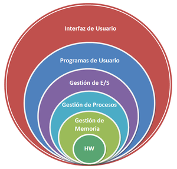
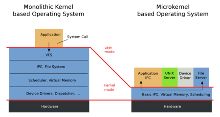
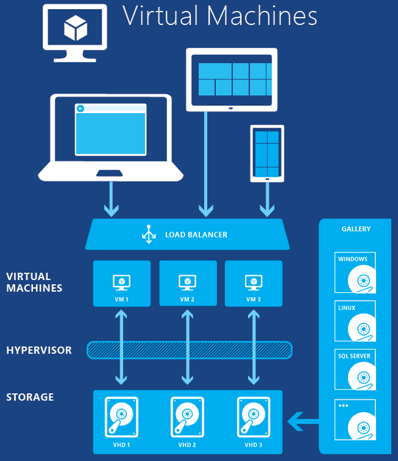

# SISTEMAS OPERATIVOS: clase 2

Fecha de creación: 1 de febrero de 2025 21:16
Clase: SISTEMAS OPERATIVOS
Fecha de la clase: 31 de enero de 2025

# Unidad I: Introducción a los SO

El kernel es el que nos permite comunicarnos con el hardware, luego viene el GUI, la forma en la que nosotros nos comunicamos con el sistema.

## Sistemas monolíticos

Todo el sistema operativo se ejecuta como un solo programa en modo kernel.

### Características

1. **Un solo núcleo.** Todas las funciones dele sistema operativos están integradas en un solo módulo.
2. **Acceso directo.** Los componentes del núcleo pueden interactuar directamente entre sí.
3. **Alto rendimiento.** Debido a que no hay necesidad de cambiar de contexto entre diferentes espacios de memoria o procesos, el rendimiento es alto.
4. **Difícil de depurar y mantener.** Al estar todo integrado, cualquier fallo puede afectar a todo el sistema y hacer cambios en un componente puede requerir revisar el resto del núcleo.
5. **Tamaño del núcleo.** Generalmente, el núcleo es grande debido a la inclusión de todas las funciones y controladores.

### Ejemplos:

- Unix tradicional
- Linux
- MS-DOS
- FreeBSD y OpenBSD

### Ventajas

- Mayor rendimiento debido a la integración directa.
- Implementación sencilla (relativa a otros diseños más complejos como microkernels).
- Menor sobrecarga en la comunicación interna.

### Desventaja

- Poca modularidad, lo que dificulta la actualización y el mantemiento.
- Un fallo en cualquier componente puede colapsar todo el sistema.
- Escalabilidad limitada comparada con otros diseños más modernos.

---

## Sistemas de capas

Es un diseño estructurado donde las funcionalidades del SO se dividen en diferentes capas, cada una de las cuales cumple un rol específico y se comunica únicamente con las capas adyacentes.

### Características

1. **Jerarquía de capas.** Cada capa tiene funciones específicas, y las capas inferiores proporcionan servicios a las superiores.
2. **Encapsulamiento.** Cada capa oculta su implementación interna y solo expone una interfaz definida para interactuar con otras capas.
3. **Comunicación controlada.** Una capa solo puede interactuar con su capa inmediatamente superior o inferior, lo que mejora la organización y reduce los errores.
4. **Facilidad de mantenimiento.** Cambios en una capa suelen no afectar directamente a otras, siempre que las interfaces se mantengan.

### Ejemplo típico de capas en un sistema

1. Capa 0: Hardware físico (CPU, memoria, dispositivos de E/S).
2. Capa 1: Gestión de procesos y multiprogramación.
3. Capa 2: Gestión de memoria.
4. Capa 3: Sistemas de entrada/salida.
5. Capa 4: Sistemas de archivos.
6. Capa 5: Interfaz de usuario (shells, entornos gráficos).

### Ejemplos:

- THE System (Technische Hogeschool Eindhoven)
- Multics
- OS/2
- Windows NT

### Ventajas

- Modularidad. Cada capa se desarrolla y prueba por separado.
- Mantenimiento sencillo. Los cambios en una capa tienen un impacto mínimo en otras.
- Claridad en el diseño. La separación por funciones hace que sea más fácil entender y depurar el sistema.

### Desventajas

- Rendimiento. La comunicación estricta entre capas puede introducir sobrecarga.
- Complejidad inicial. Diseñar un sistema con capas bien definidas puede ser complicado.
- Rigidez. La estricta interacción entre capas puede dificultar ciertas optimizadores o la integración de nuevas funcionalidades.

---

## Sistemas de microkernels

Es un tipo de SO donde el núcleo (kernel) es reducido al mínimo indispensable. Este enfoque se centra en que el kernel solo maneje las funciones básicas esenciales, como la comunicación entre procesos, gestión del CPU y la memoria.

### Características

1. **Núcleo reducido.** Solo incluye las funciones esenciales como la comunicación entre procesos, planificación de procesos y manejo básico de la memoria.
2. **Servicios en el espacio de usuario.** Servicios adicionales, como sistemas de archivos o controladores. Se implementan como procesos independientes en el espacio de usuario.
3. **Comunicación mediante mensajes.** Los componentes se comunican a través de mecanismos de paso de mensajes, lo que asegura una separación clara entre el núcleo y los servicios externos.
4. **Modularidad y flexibilidad.** Es más fácil añadir, eliminar o actualizar componentes sin modificar el núcleo.

### Ejemplos:

- Gestión de interrupciones
- Comunicación entre procesos (IPC)
- Planificación básica de procesos
- Gestión mínima de memoria

Una **interrupción** es cuando se manda una señal directa al procesador. Está concentrada en una tarea y ocurre otra.

### Ventajas

- Estabilidad. Si un componente falla (por ejemplo, un controlador), no afecta al núcleo ni al resto del sistema.
- Seguridad. Al separar los servicios del núcleo, los problemas de seguridad en un servicio no comprometen todo el sistema.
- Portabilidad. El núcleo reducido facilita portar el sistema operativo a diferentes plataformas de hardware.
- Facilidad de mantenimiento. Los servicios pueden desarrollarse y depurarse de forma independiente.

Ejemplo de portabilidad es la JVM (Java Virtual Machine) máquina virtual de Java, se puede llevar el ejecutable a otro sistema operativo. Híbrido de .exe y lo termina de compilar el nuevo sistema operativo.

### Desventajas

- Rendimiento menor. La comunicación mediante mensajes entre el núcleo y los servicios en el espacio de usuario puede ser más lenta que en un diseño monolítico.
- Complejidad de implementación. Desarrollar un sistema basado en microkernel requiere un diseño detallado para la interacción entre servicios.
- Sobrecarga adicional. Hay una mayor sobrecarga debido al cambio de contexto entre el núcleo y los servicios.

### Ejemplos:

- Minix
- QNX (sistema embebido)
- Mach (sirvió como base para macOS)
- GNU Hurd
- L4

Sistema embebidos (en los microondas)

---

## Modelo Cliente Servidor

Es un modelo de sistema operativo que organiza sus funciones y servicios en dos partes, el cliente y el servidor.

### Características

1. **Arquitectura distribuida.** Los clientes y servidores pueden ejecutarse en la misma máquina o en máquinas diferentes dentro de una red.
2. **Separación de roles:**
    1. Cliente. Es la parte que solicita servicios (acceso a archivos, impresión, recursos de red).
    2. Servidor. Es la parte que gestiona los servicios y responde a las solicitudes del cliente.
3. **Comunicación por red.** Utiliza protocolos como TCP/IP para permitir la interacción entre clientes y servidores.
4. **Escalabilidad.** Se puede agregar más servidores o clientes según sea necesario, lo que facilita la expansión del sistema.
5. **Servicios distribuidos.** Servicios como sistemas de archivos, bases de datos, autenticación y más pueden implementarse de manera independiente.

### Ventajas

- Modularidad. Los servicios están separados, lo que facilita su mantenimiento y actualización.
- Escalabilidad. Es fácil añadir más clientes o servidores para manejar mayor carga.
- Distribución de recursos. Los recursos pueden estar en ubicaciones diferentes y ser compartidos entre múltiples usuarios.
- Seguridad. El servidor centralizado facilita la implementación de políticas de seguridad.

### Desventajas

- Dependencia del servidor. Si el servidor falla, los clientes no pueden acceder al servicio.
- Sobrecarga en el servidor. Si hay demasiadas solicitudes, el servidor puede saturarse.
- Complejidad. Diseñar e implementar un sistema cliente-servidor puede ser más complejo que un sistema monolítico.

### Ejemplos:

- Microsoft Windows Server
- Linux
- UNIX con X Window System
- Novell NetWare
- macOS (modelos de red)

# Máquinas Virtuales

Es un sistema operativo diseñado para crear, administrar y ejecutar múltiples máquinas virtuales (VMs) sobre un único hardware físico.

### Características

1. **Virtualización del hardware.** Proporciona una abstracción del hardware físico, permitiendo que múltiples sistemas operativos compartan los recursos del hardware subyacente.
2. **Aislamiento.** Cada máquina virtual es independiente de las demás, lo que garantiza que un fallo o problema en una VM no afecte a las demás.
3. **Gestión de recursos.** El sistema operativo asigna y gestiona los recursos del hardware (CPU, memoria, almacenamiento, red) entre las VMs.
4. **Compatibilidad.** Permite ejecutar diferentes sistemas operativos (por ejemplo, Windows, Linux) en una misma máquina física.
5. **Flexibilidad y portabilidad.** Las máquinas virtuales pueden ser movidas entre diferentes sistemas físicos.

### Partes Principales

- Hipervisor. Es el software responsable de la virtualización. Existen dos tipos principales:
    - Tipo 1. También conocido como hipervisor “bare-metal”, correo directamente sobre el hardware físico. Ejemplo: VMware ESXi, Microsoft Hyper-V.
    - Tipo 2. Corre como una aplicación sobre un sistema operativos anfitrión. Ejemplo: VirtualBox, VMware Workstation.
- Máquinas virtuales. Cada una actúa como un sistema independiente con su propio sistema operativo y aplicaciones.
- Sistema anfitrión (Host). El sistema operativo o plataforma sobre el que se ejecuta el hipervisor o las máquinas virtuales.

### Ejemplos:

- VMware ESXi
- Microsoft Hyper-V
- KVM (Kernel-based Virtual Machine)
- Xen
- Oracle VirtualBox

### Ventajas

- Ahorro de costos
- Flexibilidad
- Escalabilidad
- Aislamiento
- Portabilidad

### Desventajas

- Sobrecarga de recursos
- Complejidad
- Dependencia del hipervisor

## ExoKernels

Es un tipo de sistema operativo que minimiza la abstracción del hardware, permitiendo que las aplicaciones gestionen directamente los recursos de hardware.

### Características

1. Minimización del núcleo
2. Control directo del hardware
3. Flexibilidad
4. Separación de mecanismo y política
    1. Mecanismo
    2. Política
5. Alto rendimiento

### Ventajas

- Eficiencia
- Personalización
- Simplicidad del núcleo
- Escalibilidad

### Desventajas

- Mayor complejidad para los desarrolladores
- Falta de estándares
- Dificultad de adopción

### Ejemplos:

- Aegis
- Xok
- Nemesis