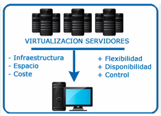

# SISTEMAS OPERATIVOS: clase 3

Fecha de creación: 7 de febrero de 2025 15:06
Clase: SISTEMAS OPERATIVOS
Fecha de la clase: 7 de febrero de 2025

## Ponencia del Ing. Luis Felipe Hernández

### Virtualización

La **virtualización de servidores** es una tecnología que permite ejecutar múltiples sistemas operativos y aplicaciones en un solo servidor físico, dividiéndolo en varias máquinas virtuales (VMs). Cada VM actúa como un servidor independiente con su propio sistema operativo y recursos asignados, como CPU, memoria y almacenamiento.

### Beneficios de la Virtualización

- Optimización de recursos
- Reducción de costos
- Mejora de la eficiencia operativa

### Virtualización en entornos locales

- Windows Server Hyper-V
- Administración y mantenimiento
    - Herramientas y mejores prácticas
- Hiperconvergencias
    - DELL (VXRAIL) y LENOVO (NUTANIX)

### Virtualización en la Nube

- Microsoft Azure
- Migración a la Nube

### Entornos Híbridos

- Azure Arc
- Ventaja Híbrida de Azure

2