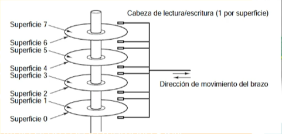
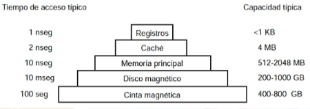

# SISTEMAS OPERATIVOS: clase 4

Fecha de creación: 14 de febrero de 2025 18:09
Clase: SISTEMAS OPERATIVOS
Fecha de la clase: 14 de febrero de 2025

# Funciones principales de un sistema operativo

## ¿Qué es un sistema operativo?

Es el software principal que gestiona el hardware y el software de una computadora. Actúa como intermediario entre los usuarios y los dispositivos físicos, permitiendo la ejecución de programas y el manejo eficiente de los recursos

## Funciones Principales

### 1. Gestión de procesos

- Un proceso es un programa en ejecución.
- El SO se encarga de crear, ejecutar, suspender y terminar procesos.
- También administra la multitarea, asignando tiempo de CPU a cada proceso según su prioridad.
- Utiliza algoritmos de planificación para optimizar el uso del procesador.

### 2. Gestión de memoria

- Controla el uso de la memoria RAM asignándola y liberándola según las necesidades de los procesos.
- Implemente técnicas como la memoria virtual, permitiendo ejecutar programas más grandes que la memoria disponible.
- Evita conflictos entre procesos mediante mecanismos de protección y paginación.

<aside>
📝

RAM: Random Access Memory

ROM: Read Only Memory

</aside>

- [x] Investigación sobre memoria ROM

La memoria caché guarda rutas dentro de la ROM

| Tiempo de acceso típico |                   | Capacidad típica |
| ----------------------- | ----------------- | ---------------- |
| 1 nseg                  | Registros         | <1 KB            |
| 2 nseg                  | Cache             | 4 MB             |
| 10 nseg                 | Memoria principal | 512-2048 MB      |
| 10 nseg                 | Disco magnético   | 200-1000 GB      |
| 100 nseg                | Cinta magnética   | 400-800 GB       |

### 3. Gestión de almacenamiento

- Administra el acceso a los discos duros, SSDs y otros dispositivos de almacenamiento.
- Organiza archivos y directorios mediante sistemas de archivos como **`NTFS, FAT32, EXT4, etc.`**
- Maneja la lectura y escritura en discos asegurando la integridad de los datos.

### 4. Gestión de dispositivos de entrada y salida (E/S)

- Controla los periféricos como teclado, ratón, impresora, monitor, etc.
- Utiliza controladores (drivers) para facilitar la comunicación entre el hardware y el software.
- Coordina las solicitudes de entrada y salida para evitar conflictos entre dispositivos.

### 5. Gestión de usuarios y seguridad

- Maneja permisos y restricciones de acceso a archivos y recursos del sistema.
- Proporciona autenticación mediante contraseñas, cifrado y biometría.
- Implementa protección contra virus, malware y ataques cibernéticos mediante firewalls y políticas de seguridad.
