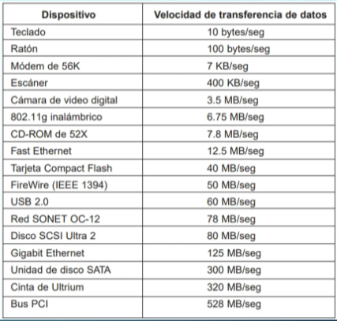

# SISTEMAS OPERATIVOS: clase 7

Fecha de creación: 7 de marzo de 2025 17:58
Clase: SISTEMAS OPERATIVOS
Fecha de la clase: 7 de marzo de 2025

# Dispositivos de Entrada y Salida: Componentes clave en la interacción con la tecnología

## Clasificación de los dispositivos E/S

1. Dispositivos de entrada. Permiten a los usuarios introducir datos en una computadora. Ejemplos: teclados, ratones y escáneres.
2. Dispositivos de salida. Presentan información procesada a los usuarios. Ejemplos: monitores, impresoras y altavoces.
3. Dispositivos combinados. Integran funciones de entrada y salida. Ejemplo: pantalla táctil que permite interacción directa.

<aside>
📝

Antes las entradas de los dispositivos eran PS2, ahora todos son USB.

</aside>

## Importancia en los sistemas informáticos

### Función de los dispositivos de E/S

Los dispositivos de entrada y salida permiten la interacción entre los usuarios y las computadoras, facilitando la comunicación efectiva.

### Experiencia del usuario

Un correcto funcionamiento de los dispositivos de E/S es crucial para una experiencia de usuario fluida y sin interrupciones.

### Importancia en hardware y software

Los dispositivos de E/S son esenciales tanto en hardware como en software, garantizando que los comando y datos fluyan sin problemas.

# Dispositivos de Entrada

## Teclados y ratones

### Dispositivos de entrada esenciales

los teclados y ratones son fundamentales para la interacción con las computadoras, facilitando tareas cotidianas.

### Control del cursor

Los ratones permiten un control preciso del cursor, mejorando la navegación y la selección de objetos en pantalla.

### Diseño ergonómico

El diseño ergonómico de teclados y ratones reduce la fatiga y mejora la comodidad durante largas sesiones de trabajo.

### Evolución tecnológica

La evolución de estos dispositivos ha llevado a mejoras en su funcionalidad y en la experiencia del usuario.

## Escáneres y cámaras

### Función de los escáneres

Los escáneres convierten documentos físicos en archivos digitales, facilitando la digitalización y le almacenamiento de información.

### Captura de imágenes con cámaras

Las cámaras permiten capturar imágenes y videos, siendo herramientas clave para la documentación visual y la comunicación.

### Aplicaciones d diseño y documentación

Ambos dispositivos son esenciales en aplicaciones de diseño, documentación y comunicación, mejorando la eficiencia de trabajo.

## Micrófonos y dispositivos de reconocimiento de voz

### Importancia de los micrófonos

Los micrófonos son esenciales para la captura de audio en grabaciones musicales, podcasts y comunicaciones, facilitando la transmisión de información.

### Reconocimiento de voz

Los dispositivos de reconocimiento de voz permiten la entrada d datos a través de comandos de voz, mejorando la accesibilidad para usuarios con discapacidades.

### Aplicaciones practicas

Ambas tecnologías, micrófonos y dispositivos de reconocimiento de voz, se utilizan en diversas aplicaciones como asistentes virtuales y en la grabación de audio.

# Dispositivos de Salida

## Monitores y pantallas

### Dispositivos de Salida

Los monitorees y pantallas son esenciales para mostrar datos gráficos y textuales, facilitando la interacción del usuario con el sistema.

### Calidad de pantalla

La calidad de la pantalla afecta directamente la claridad y definición de la información presentada, mejorando la experiencia visual del usuario.

## Impresoras y proyectores

### Función de las impresoras

Las impresoras son dispositivos esenciales que transforman documentos digitales en copias físicas en papel, lo cual es fundamental para muchas tareas.

### Uso de proyectores

Los proyectores son herramientas valiosas que permiten mostrar información n pantallas grandes, facilitando presentaciones efectivas y aprendizaje en aulas.

## Altavoces y dispositivos de audio

### Función de los altavoces

Los altavoces son esenciales para la salida de sonido y mejoran la experiencia auditiva en diversas aplicaciones multimedia.

### Interacción multimedia

Los dispositivos de audio enriquecen la interacción con el contenido audiovisual, permitiendo una experiencia mas inmersiva y envolvente.

### Variedad de dispositivos

Existen diversos dispositivos de audio, desde altavoces portátiles hasta sistemas de sonido envolvente, adaptándose a diferentes necesidades.

# Dispositivos Combinados

## Pantallas táctiles

### Interacción directa

Las pantallas táctiles permiten a los usuarios interactuar directamente con los dispositivos mediante el toque, facilitando una experiencia mas intuitiva.

### Funcionalidad de Entrada y Salida

Combinan la funcionalidad de entrada y salida, permitiendo a los usuarios navegar y ejecutar acciones de forma sencilla.

## Módems y tarjetas de red

### Conexión a internet

Los módems son esenciales para establecer conexiones a internet, facilitando la comunicación entre dispositivos y redes.

### Tarjetas de red

Las tarjetas de red permiten la conexión de dispositivos dentro de una red local, asegurando la transferencia de datos eficiente.

### Comunicación digital

Ambos dispositivos combinan funciones de entrada y salida para facilitar la comunicación en entornos digitales.

## Dispositivos de almacenamiento como discos duros y unidades USB

### Función de almacenamiento

Los discos duros y unidades USB son fundamentales para el almacenamiento, permitiendo guardar grandes cantidades de datos de forma segura.

### Transferencia de datos

Estos dispositivos facilitan la transferencia de datos entre computadoras y otros dispositivos, mejorando la accesibilidad y la velocidad del intercambio de información.

### Uso en dispositivos móviles

Las unidades USB y lo discos duros externos

# Avances tecnológicos recientes

### Dispositivos de entrada por gestos

El desarrollo de dispositivos de entrada por gestos permite una interacción mas natural y fluida con la tecnología, mejorando la experiencia del usuario.

### Inteligencia artificial en reconocimiento de voz

La integración de la inteligencia artificial en herramientas de reconocimiento de voz esta revolucionando la forma en que interactuamos con nuestros dispositivos, haciéndolos mas inteligentes y receptivos.

### Transformación de la interacción con dispositivos

Estos avances tecnológicos están cambiando significativamente nuestra forma de interactuar con los dispositivos, haciéndolos mas accesibles y eficientes.

# Dispositivos inteligentes y de realidad aumentada

### Asistentes de voz

### Auriculares de realidad aumentada

### Experiencias interactivas

# El futuro de los dispositivos de E/S en la informática

### Evolución de dispositivos

### Miniaturización

Permite que los dispositivos sean mas compactos y ligeros, facilitando el uso diario y la portabilidad.

### Conectividad e integración

La conectividad se esta volviendo esencial, permitiendo la integración de múltiples tecnologías en un solo dispositivo, mejorando la accesibilidad.

# Rango de velocidades



```java
import java.io.IOException;

public class Teclado{

	public static void main(String[] args) throws IOException{

		//captura la tecla que se presiona
		System.out.println("Presiona una tecla para conocer su codigo: ");

		//siempre que se presione una tecla entra en el bucle
		while(true){
			//lee la tecla presionada en codigo ASCII
			int keyCode = System.in.read();
			System.out.println("Codigo de tecla: " + keyCode);
			//imprime en pantalla la variable keyCode convertida a caracter
			System.out.println("Tecla presionada: " + (char) keyCode);
		}
	}
}
```
