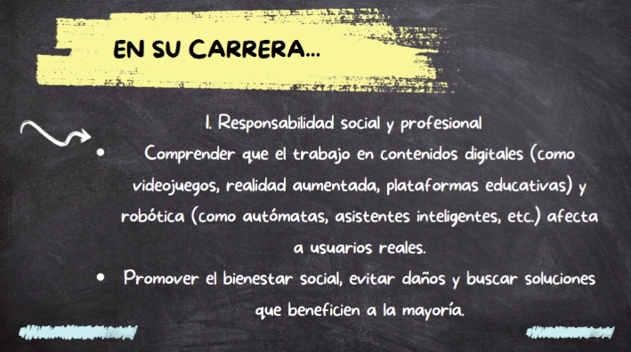

# ÉTICA: clase 16

Fecha de creación: 17 de mayo de 2025 18:08
Clase: ÉTICA
Fecha de la clase: 17 de mayo de 2025

# Ética Profesional

## ¿Qué es?

La ética profesional es una rama de la ética aplicada que se encarga de estudiar los principios y normas que deben regir la conducta de los profesionales en el ejercicio de su labor. Busca asegurar que el trabajo se realice con responsabilidad, integridad y compromiso social.

## Objetivo

- Promover la confianza entre profesionales y clientes o usuarios.
- Garantizar un comportamiento justo y equitativo.
- Proteger el interés público.
- Fortalecer la reputación y credibilidad de la profesión.
- Prevenir conflictos de interés, negligencia, corrupción o abuso de poder.

## Principios básicos de la Ética Profesional

- **Responsabilidad:** cumplir con los deberes y asumir consecuencias.
- **Honestidad:** actuar con sinceridad y transparencia.
- **Justicia:** tratar a todos de manera equitativa.
- **Respeto:** hacia colegas, clientes y normas institucionales.
- **Confidencialidad:** proteger la información privada o sensible.
- **Lealtad:** hacia la profesión y la verdad, por encima de intereses personales.

## Dimensiones de la Ética Profesional

1. Personal
2. Social
3. Institucional

## Desafíos comunes

- Choques de intereses: El beneficio personal o económico puede entrar en conflicto con el deber profesional.
- Tecnología y nuevas prácticas: Lo que es posible hacer técnicamente no siempre es ético hacerlo.
- Presión externa o interna: Por ejemplo, hacer algo incorrecto por conservar un puesto o complacer a un superior.
- Falta de regulación clara: A veces, no hay normas específicas para ciertos comportamientos, y se debe apelar al juicio ético.

### 1. Corrupción en obras públicas

Casos como el de la prensa El Chaparral (investigado en la década de 2010) mostraron pagos inflados y contratos con empresas en condiciones dudosas.

Se violaron principios de honestidad, justicia y responsabilidad profesional.

### 2. Manipulación de información en instituciones públicas

En algunos casos, funcionarios han sido acusados de alterar datos oficiales o censurar informes técnicos políticas.

Esto representa una clara falta de transparencia, veracidad y compromiso profesional.

### 3. Violación de confidencialidad en salud

Ha habido denuncias contra personal médico o administrativo por divulgar información personal de pacientes, especialmente en temas sensibles como VIH o salud mental.

Aquí se transgrede el principio de confidencialidad y respeto a la dignidad humana.

